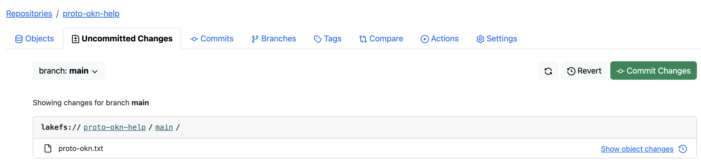

# Set Up Your FRINK Repo in the Landing Zone
Theme 1 Teams, there are several ways to upload your graph to the FRINK Landing Zone found on lakeFS. We recommend uploading through the website for smaller files and using Amazon's S3 Tool for larger files or for automating the process. 

!!! note

    For each method, you will need to request credentials for accessing lakeFS. These credentials are an **Access Key ID** and a **Secret Acess 
    Key**. You may request these either by direct messaging Yaphet Kebede through our PROTO-OKN Slack channel or by emailing Yaphet at kebedey at
    renci dot org. With your request please provide the name of your dataset, that will be used to create a repository to host your data on lakeFS.

??? warning
   
    We are currently trying to resolve a problem with extremely large files (e.g., 100GB or more). If you run into a problem uploading your file and 
    it is around or over 100GB, please contact Yaphet Kebede at kebedey at renci dot org.

## Repository Structure

Every dataset hosted in FRINK will have its own lakeFS repository. Data submissions should be made by uploading the data to the develop branch of the respective repository. After uploads and commits are completed on the develop branch, the data update can be finalized by creating a merge request to the main branch.


## Uploading Data 

### Upload through the website

!!! info inline end ""	

     See the <a href="https://docs.lakefs.io/quickstart/">lakeFS QuickStart guide</a> for more information.</strong></font> 
  


1. Navigate to [https://frink-lakefs.apps.renci.org/](https://frink-lakefs.apps.renci.org/)

2. Enter your **Access Key ID** and your **Secret Access Key** to log in.

3. Browse to your working repository.

4. By default, your repository would be on main branch, double check to make sure that is set to `develop` branch. 

5. Click the **Upload Object** button to upload your dataset/graph.   


6. The **Upload Object** pop-up window will appear offering you the option to drag and drop a single file from your desktop to the pop-up window. Once your file appears in the pop-up, click the **Upload** button to complete the upload. (Although there is a **Path** text field, it will not recognize a file path on your local machine. So please use the drag and drop feature.)
     

	!!! warning ""

	 	**Repeat this step for each file you need to upload.** 
	 
7. Your upload is not complete until you commit the change to lakeFS. Click the **Uncommitted Changes** tab and you will see the upload you made in the previous steps. Click the **Commit Changes** button.
8. The **Commit Changes** pop-up window will appear. Please enter a **Commit Message** providing information about the nature of your upload. We suggest you include your name in case multiple individuals from your team are uploading files to lakeFS. The date and time will be recorded automatically.  


  
### Upload Using Amazon's S3 Command Line Interface (CLI) Tool
!!! info inline end ""

    More details about using the AWS CLI can be found at <a href="https://docs.lakefs.io/integrations/aws_cli.html">Using lakeFS with the AWS CLI</a>.     
    <br>
    This could work with other s3 clients. Possible options are also listed at <a href="https://docs.lakefs.io/howto/copying.html">Copying Data
    to/from lakeFS</a>.

  
   
1. Install the AWS CLI Toolkit.
    * Follow the steps in the [AWS CLI installation guide](https://docs.aws.amazon.com/cli/v1/userguide/cli-chap-install.html) to install the AWS CLI toolkit.
    
2. Set up an AWS profile. Creating a profile makes it easier to switch between different AWS services and lakeFS.
    * Open a new terminal.
    * Configure a profile for lakeFS using your **Access Key ID** and **Secret Access Key**:
    ```
    aws configure --profile lakefs
    ```
    
3. Upload files to the repository.
    * In the terminal, upload files to the new repository on the main branch:
    ``` 
    aws s3 cp my-local-dataset.hdt s3://my-repo/develop/my-local-graph.hdt --endpoint="https://frink-lakefs.apps.renci.org" --profile lakefs
	```

    * This example will copy `my-local-dataset.hdt` file to a repo called `my-repo` on the `develop` branch, renamed as `my-local-graph.hdt`. It forces the s3 tool to target FRINK lakefs by providing the `--endpoint` option.
4. Commit the upload.
    * Back in the web browser, go to your repository.
    * Navigate to the **Uncommitted Changes** tab. Click the **Commit Changes** button.   
       
    * The **Commit Changes** pop-up window will appear. Please enter an appropriate **Commit Message**.  
     
     


### Upload from other Storage providers (Azure, S3 etc...)

!!! info inline end ""   
    For more details on rclone commands and options, visit the [rclone documentation](https://rclone.org/docs/).


This guide can serve as a way to configure rclone as a tool to copy files to lakefs. In this guide we will use 
Azure blob storage as an example. 

1. Install rclone

    If you haven't installed rclone yet, you can do so by following the instructions on the [rclone website](https://rclone.org/downloads/).

2. Configure rclone source with Azure Blob Storage
    - **Create a new rclone remote for Azure Blob Storage**:
         Open a terminal and run the following command to configure a new remote:   
         ```
         rclone config
         ```      
    - **Create a new remote**:
        - Type `n` to create new remote and press Enter.
        - Name the remote (e.g. `azureblob`)
    - **Choose the backend**: 
        - When prompted to choose a storage type , select `32` (Microsoft Azure Blob Storage)
    - **Configure the Azure Blob Storge backend**:
      -  Follow the prompts to configure the Azure Blob Storage backend. You will need:
        - `Account Name`: Your Azure Storage account name.
        - `Account Key`: Your Azure Storage account key. 
    - **Save the configuration**:
      - After providing the necessary information, confirm the setup and save the configuration.

3. Configure rclone with lakeFS
    - **Create a new rclone remote for Azure Blob Storage**:
         Open a terminal and run the following command to configure a new remote:
         ```
         rclone config
         ```
    - **Create a new remote**:
        - Type `n` to create new remote and press Enter.
        - Name the remote (e.g. `lakefs`) 
    - **Choose the backend**: 
        - When prompted to choose a storage type , select `5` (S3) and then select `31` (Other) on the next prompt
    - **Configure the lakeFS backend**:
      -  Follow the prompts to configure the lakefs backend. You will need:
        - `AWS Access Key ID`: Your lakeFS access key id .
        - `AWS Secret Access Key`: Your lakefs secret access key.
        - For region leave empty
        - `Endpoint for S3 API`: this is the url for lakefs https://frink-lakefs.apps.renci.org
        - Follow the rest of the prompt according to your needs
    - **Save the configuration**:
      - After providing the necessary information, confirm the setup and save the configuration.
    
4. Verify the Configuration

    You can list the contents of your Azure Blob Storage and lakeFS repository to verify the configuration:
```
rclone ls azureblob:your-container-name
rclone ls lakefs:your-repository-name
```
If the configuration is correct, you should see the contents of your Azure Blob Storage container and lakeFS bucket.

5. Copy Data from Azure Blob Storage to lakeFS

    To copy data from Azure Blob Storage to your lakeFS server, use the rclone copy or rclone sync command. Here's an example using the rclone copy command:
``` 
rclone copy azureblob:your-container-name/path/in/container lakefs:your-repository-name/develop/location/of/file
```