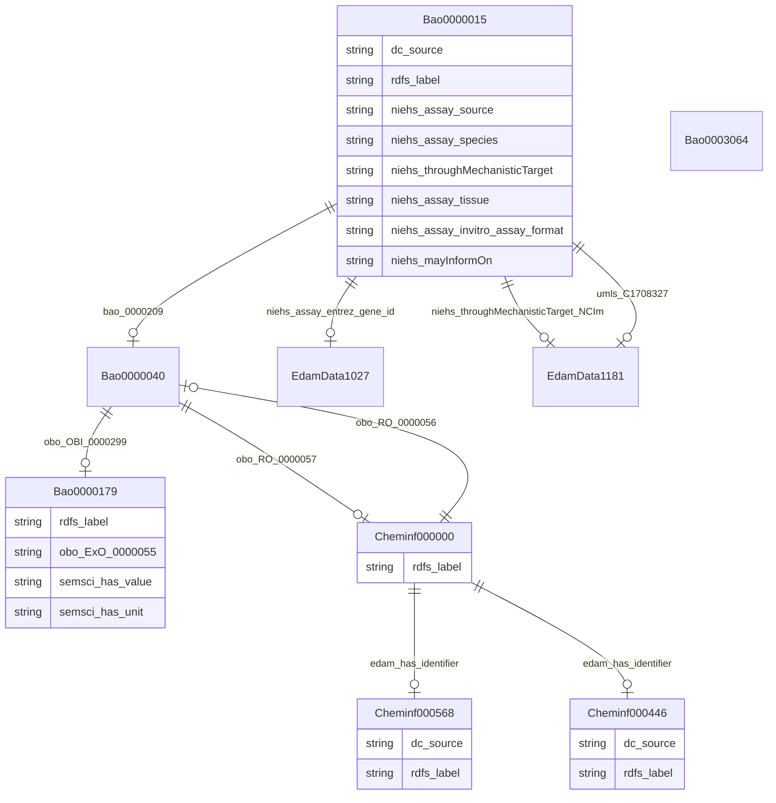

# Biobricks Ice
## An Open Knowledge Graph for Cheminformatics and Chemical Safety

## Schema Diagram

## IRI prefixes

* bao: http://www.bioassayontology.org/bao#BAO_
* cheminf: http://purl.obolibrary.org/obo/CHEMINF_
* dc: http://purl.org/dc/elements/1.1/
* edam: http://edamontology.org/
* linkml: https://w3id.org/linkml/
* niehs: https://ice.ntp.niehs.nih.gov/property/
* obo: http://purl.obolibrary.org/obo/
* rdf: http://www.w3.org/1999/02/22-rdf-syntax-ns#
* rdfs: http://www.w3.org/2000/01/rdf-schema#
* semsci: http://semanticscience.org/resource/SIO_
* umls: https://identifiers.org/umls:

## Classes

| Class | Description |
| --- | --- |
| [Bao0000015](https://github.com/frink-okn/graph-descriptions/blob/main/biobricks-ice-kg/classes/Bao0000015.md) | No type description provided Class with 2063 occurences.| 
| [Bao0000040](https://github.com/frink-okn/graph-descriptions/blob/main/biobricks-ice-kg/classes/Bao0000040.md) | No type description provided Class with 202322 occurences.| 
| [Bao0000179](https://github.com/frink-okn/graph-descriptions/blob/main/biobricks-ice-kg/classes/Bao0000179.md) | No type description provided Class with 413168 occurences.| 
| [Bao0003064](https://github.com/frink-okn/graph-descriptions/blob/main/biobricks-ice-kg/classes/Bao0003064.md) | No type description provided Class with 59 occurences.| 
| [Cheminf000000](https://github.com/frink-okn/graph-descriptions/blob/main/biobricks-ice-kg/classes/Cheminf000000.md) | No type description provided Class with 197214 occurences.| 
| [Cheminf000446](https://github.com/frink-okn/graph-descriptions/blob/main/biobricks-ice-kg/classes/Cheminf000446.md) | No type description provided Class with 538147 occurences.| 
| [Cheminf000568](https://github.com/frink-okn/graph-descriptions/blob/main/biobricks-ice-kg/classes/Cheminf000568.md) | No type description provided Class with 538131 occurences.| 
| [EdamData1027](https://github.com/frink-okn/graph-descriptions/blob/main/biobricks-ice-kg/classes/EdamData1027.md) | No type description provided Class with 526 occurences.| 
| [EdamData1181](https://github.com/frink-okn/graph-descriptions/blob/main/biobricks-ice-kg/classes/EdamData1181.md) | No type description provided Class with 59 occurences.| 

## Slots

| Slot | Description |
| --- | --- |
| [bao_0000209](https://github.com/frink-okn/graph-descriptions/blob/main/biobricks-ice-kg/slots/bao_0000209.md) | No slot description provided 8208 occurrences with subject type bao_0000015 and object type bao_0000040.|
| [dc_source](https://github.com/frink-okn/graph-descriptions/blob/main/biobricks-ice-kg/slots/dc_source.md) | No slot description provided 538147 occurrences with subject type cheminf_000446 and object type string. 538131 occurrences with subject type cheminf_000568 and object type string. 3990 occurrences with subject type bao_0000015 and object type string.|
| [edam_has_identifier](https://github.com/frink-okn/graph-descriptions/blob/main/biobricks-ice-kg/slots/edam_has_identifier.md) | No slot description provided 197214 occurrences with subject type cheminf_000000 and object type cheminf_000446. 197214 occurrences with subject type cheminf_000000 and object type cheminf_000568.|
| [niehs_assay_entrez_gene_id](https://github.com/frink-okn/graph-descriptions/blob/main/biobricks-ice-kg/slots/niehs_assay_entrez_gene_id.md) | No slot description provided 1814 occurrences with subject type bao_0000015 and object type edam_data_1027.|
| [niehs_assay_invitro_assay_format](https://github.com/frink-okn/graph-descriptions/blob/main/biobricks-ice-kg/slots/niehs_assay_invitro_assay_format.md) | No slot description provided 1814 occurrences with subject type bao_0000015 and object type string.|
| [niehs_assay_source](https://github.com/frink-okn/graph-descriptions/blob/main/biobricks-ice-kg/slots/niehs_assay_source.md) | No slot description provided 1814 occurrences with subject type bao_0000015 and object type string.|
| [niehs_assay_species](https://github.com/frink-okn/graph-descriptions/blob/main/biobricks-ice-kg/slots/niehs_assay_species.md) | No slot description provided 1814 occurrences with subject type bao_0000015 and object type string.|
| [niehs_assay_tissue](https://github.com/frink-okn/graph-descriptions/blob/main/biobricks-ice-kg/slots/niehs_assay_tissue.md) | No slot description provided 1814 occurrences with subject type bao_0000015 and object type string.|
| [niehs_mayInformOn](https://github.com/frink-okn/graph-descriptions/blob/main/biobricks-ice-kg/slots/niehs_mayInformOn.md) | No slot description provided 3570 occurrences with subject type bao_0000015 and object type string.|
| [niehs_throughMechanisticTarget](https://github.com/frink-okn/graph-descriptions/blob/main/biobricks-ice-kg/slots/niehs_throughMechanisticTarget.md) | No slot description provided 2753 occurrences with subject type bao_0000015 and object type string.|
| [niehs_throughMechanisticTarget_NCIm](https://github.com/frink-okn/graph-descriptions/blob/main/biobricks-ice-kg/slots/niehs_throughMechanisticTarget_NCIm.md) | No slot description provided 3015 occurrences with subject type bao_0000015 and object type edam_data_1181.|
| [obo_ExO_0000055](https://github.com/frink-okn/graph-descriptions/blob/main/biobricks-ice-kg/slots/obo_ExO_0000055.md) | No slot description provided 135113 occurrences with subject type bao_0000179 and object type string.|
| [obo_OBI_0000299](https://github.com/frink-okn/graph-descriptions/blob/main/biobricks-ice-kg/slots/obo_OBI_0000299.md) | No slot description provided 414162 occurrences with subject type bao_0000040 and object type bao_0000179.|
| [obo_RO_0000056](https://github.com/frink-okn/graph-descriptions/blob/main/biobricks-ice-kg/slots/obo_RO_0000056.md) | No slot description provided 202322 occurrences with subject type cheminf_000000 and object type bao_0000040.|
| [obo_RO_0000057](https://github.com/frink-okn/graph-descriptions/blob/main/biobricks-ice-kg/slots/obo_RO_0000057.md) | No slot description provided 202322 occurrences with subject type bao_0000040 and object type cheminf_000000.|
| [rdfs_label](https://github.com/frink-okn/graph-descriptions/blob/main/biobricks-ice-kg/slots/rdfs_label.md) | No slot description provided 197214 occurrences with subject type cheminf_000000 and object type string. 413168 occurrences with subject type bao_0000179 and object type string. 542470 occurrences with subject type cheminf_000446 and object type string. 542456 occurrences with subject type cheminf_000568 and object type string. 2063 occurrences with subject type bao_0000015 and object type string.|
| [semsci_has_unit](https://github.com/frink-okn/graph-descriptions/blob/main/biobricks-ice-kg/slots/semsci_has_unit.md) | No slot description provided 413168 occurrences with subject type bao_0000179 and object type string.|
| [semsci_has_value](https://github.com/frink-okn/graph-descriptions/blob/main/biobricks-ice-kg/slots/semsci_has_value.md) | No slot description provided 413647 occurrences with subject type bao_0000179 and object type string.|
| [umls_C1708327](https://github.com/frink-okn/graph-descriptions/blob/main/biobricks-ice-kg/slots/umls_C1708327.md) | No slot description provided 3015 occurrences with subject type bao_0000015 and object type edam_data_1181.|

