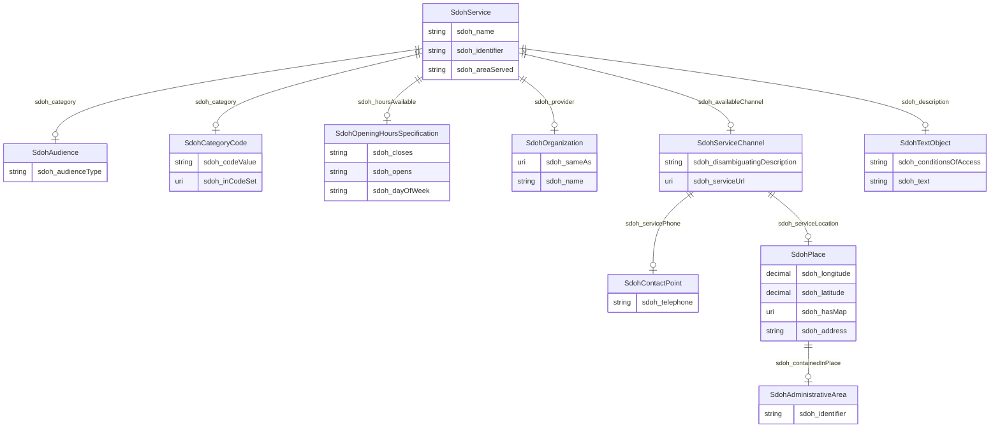

# TODO_Give_this_schema_a_name!

TODO -- tell the world what this schema describes.

URI: dream-kg

Name: dream-kg

## Schema Diagram

## IRI prefixes

* dreamkg: http://www.semanticweb.org/dreamkg/ijcai/
* linkml: https://w3id.org/linkml/
* rdf: http://www.w3.org/1999/02/22-rdf-syntax-ns#
* sdoh: http://schema.org/

## Classes

| Class | Description |
| --- | --- |
| [SdohAdministrativeArea](https://github.com/frink-okn/graph-descriptions/blob/main/dream-kg/classes/SdohAdministrativeArea.md) | A geographical region, typically under the jurisdiction of a particular government. Class with 39 occurences.| 
| [SdohAudience](https://github.com/frink-okn/graph-descriptions/blob/main/dream-kg/classes/SdohAudience.md) | Intended audience for an item, i.e. the group for whom the item was created. Class with 81 occurences.| 
| [SdohCategoryCode](https://github.com/frink-okn/graph-descriptions/blob/main/dream-kg/classes/SdohCategoryCode.md) | A Category Code. Class with 157 occurences.| 
| [SdohContactPoint](https://github.com/frink-okn/graph-descriptions/blob/main/dream-kg/classes/SdohContactPoint.md) | A contact point&#x2014;for example, a Customer Complaints department. Class with 87 occurences.| 
| [SdohOpeningHoursSpecification](https://github.com/frink-okn/graph-descriptions/blob/main/dream-kg/classes/SdohOpeningHoursSpecification.md) | A structured value providing information about the opening hours of a place or a certain service inside a place.\n\n
The place is __open__ if the [[opens]] property is specified, and __closed__ otherwise.\n\nIf the value for the [[closes]] property is less than the value for the [[opens]] property then the hour range is assumed to span over the next day.
       Class with 609 occurences.| 
| [SdohOrganization](https://github.com/frink-okn/graph-descriptions/blob/main/dream-kg/classes/SdohOrganization.md) | An organization such as a school, NGO, corporation, club, etc. Class with 87 occurences.| 
| [SdohPlace](https://github.com/frink-okn/graph-descriptions/blob/main/dream-kg/classes/SdohPlace.md) | Entities that have a somewhat fixed, physical extension. Class with 87 occurences.| 
| [SdohService](https://github.com/frink-okn/graph-descriptions/blob/main/dream-kg/classes/SdohService.md) | A service provided by an organization, e.g. delivery service, print services, etc. Class with 87 occurences.| 
| [SdohServiceChannel](https://github.com/frink-okn/graph-descriptions/blob/main/dream-kg/classes/SdohServiceChannel.md) | A means for accessing a service, e.g. a government office location, web site, or phone number. Class with 174 occurences.| 
| [SdohTextObject](https://github.com/frink-okn/graph-descriptions/blob/main/dream-kg/classes/SdohTextObject.md) | A text file. The text can be unformatted or contain markup, html, etc. Class with 87 occurences.| 

## Slots

| Slot | Description |
| --- | --- |
| [sdoh_address](https://github.com/frink-okn/graph-descriptions/blob/main/dream-kg/slots/sdoh_address.md) | No slot description provided 93 occurrences with subject type sdoh_Place and object type string.|
| [sdoh_areaServed](https://github.com/frink-okn/graph-descriptions/blob/main/dream-kg/slots/sdoh_areaServed.md) | No slot description provided 87 occurrences with subject type sdoh_Service and object type string.|
| [sdoh_audienceType](https://github.com/frink-okn/graph-descriptions/blob/main/dream-kg/slots/sdoh_audienceType.md) | No slot description provided 81 occurrences with subject type sdoh_Audience and object type string.|
| [sdoh_availableChannel](https://github.com/frink-okn/graph-descriptions/blob/main/dream-kg/slots/sdoh_availableChannel.md) | No slot description provided 174 occurrences with subject type sdoh_Service and object type sdoh_ServiceChannel.|
| [sdoh_category](https://github.com/frink-okn/graph-descriptions/blob/main/dream-kg/slots/sdoh_category.md) | No slot description provided 806 occurrences with subject type sdoh_Service and object type sdoh_CategoryCode. 539 occurrences with subject type sdoh_Service and object type sdoh_Audience.|
| [sdoh_closes](https://github.com/frink-okn/graph-descriptions/blob/main/dream-kg/slots/sdoh_closes.md) | No slot description provided 623 occurrences with subject type sdoh_OpeningHoursSpecification and object type string.|
| [sdoh_codeValue](https://github.com/frink-okn/graph-descriptions/blob/main/dream-kg/slots/sdoh_codeValue.md) | No slot description provided 158 occurrences with subject type sdoh_CategoryCode and object type string.|
| [sdoh_conditionsOfAccess](https://github.com/frink-okn/graph-descriptions/blob/main/dream-kg/slots/sdoh_conditionsOfAccess.md) | No slot description provided 88 occurrences with subject type sdoh_TextObject and object type string.|
| [sdoh_containedInPlace](https://github.com/frink-okn/graph-descriptions/blob/main/dream-kg/slots/sdoh_containedInPlace.md) | No slot description provided 88 occurrences with subject type sdoh_Place and object type sdoh_AdministrativeArea.|
| [sdoh_dayOfWeek](https://github.com/frink-okn/graph-descriptions/blob/main/dream-kg/slots/sdoh_dayOfWeek.md) | No slot description provided 609 occurrences with subject type sdoh_OpeningHoursSpecification and object type string.|
| [sdoh_description](https://github.com/frink-okn/graph-descriptions/blob/main/dream-kg/slots/sdoh_description.md) | No slot description provided 87 occurrences with subject type sdoh_Service and object type sdoh_TextObject.|
| [sdoh_disambiguatingDescription](https://github.com/frink-okn/graph-descriptions/blob/main/dream-kg/slots/sdoh_disambiguatingDescription.md) | No slot description provided 174 occurrences with subject type sdoh_ServiceChannel and object type string.|
| [sdoh_hasMap](https://github.com/frink-okn/graph-descriptions/blob/main/dream-kg/slots/sdoh_hasMap.md) | No slot description provided 88 occurrences with subject type sdoh_Place and object type uri.|
| [sdoh_hoursAvailable](https://github.com/frink-okn/graph-descriptions/blob/main/dream-kg/slots/sdoh_hoursAvailable.md) | No slot description provided 609 occurrences with subject type sdoh_Service and object type sdoh_OpeningHoursSpecification.|
| [sdoh_identifier](https://github.com/frink-okn/graph-descriptions/blob/main/dream-kg/slots/sdoh_identifier.md) | No slot description provided 39 occurrences with subject type sdoh_AdministrativeArea and object type string. 87 occurrences with subject type sdoh_Service and object type string.|
| [sdoh_inCodeSet](https://github.com/frink-okn/graph-descriptions/blob/main/dream-kg/slots/sdoh_inCodeSet.md) | No slot description provided 157 occurrences with subject type sdoh_CategoryCode and object type uri.|
| [sdoh_latitude](https://github.com/frink-okn/graph-descriptions/blob/main/dream-kg/slots/sdoh_latitude.md) | No slot description provided 89 occurrences with subject type sdoh_Place and object type decimal.|
| [sdoh_longitude](https://github.com/frink-okn/graph-descriptions/blob/main/dream-kg/slots/sdoh_longitude.md) | No slot description provided 89 occurrences with subject type sdoh_Place and object type decimal.|
| [sdoh_name](https://github.com/frink-okn/graph-descriptions/blob/main/dream-kg/slots/sdoh_name.md) | No slot description provided 88 occurrences with subject type sdoh_Service and object type string. 89 occurrences with subject type sdoh_Organization and object type string.|
| [sdoh_opens](https://github.com/frink-okn/graph-descriptions/blob/main/dream-kg/slots/sdoh_opens.md) | No slot description provided 631 occurrences with subject type sdoh_OpeningHoursSpecification and object type string.|
| [sdoh_provider](https://github.com/frink-okn/graph-descriptions/blob/main/dream-kg/slots/sdoh_provider.md) | No slot description provided 87 occurrences with subject type sdoh_Service and object type sdoh_Organization.|
| [sdoh_sameAs](https://github.com/frink-okn/graph-descriptions/blob/main/dream-kg/slots/sdoh_sameAs.md) | No slot description provided 127 occurrences with subject type sdoh_Organization and object type uri.|
| [sdoh_serviceLocation](https://github.com/frink-okn/graph-descriptions/blob/main/dream-kg/slots/sdoh_serviceLocation.md) | No slot description provided 87 occurrences with subject type sdoh_ServiceChannel and object type sdoh_Place.|
| [sdoh_servicePhone](https://github.com/frink-okn/graph-descriptions/blob/main/dream-kg/slots/sdoh_servicePhone.md) | No slot description provided 87 occurrences with subject type sdoh_ServiceChannel and object type sdoh_ContactPoint.|
| [sdoh_serviceUrl](https://github.com/frink-okn/graph-descriptions/blob/main/dream-kg/slots/sdoh_serviceUrl.md) | No slot description provided 188 occurrences with subject type sdoh_ServiceChannel and object type uri.|
| [sdoh_telephone](https://github.com/frink-okn/graph-descriptions/blob/main/dream-kg/slots/sdoh_telephone.md) | No slot description provided 87 occurrences with subject type sdoh_ContactPoint and object type string.|
| [sdoh_text](https://github.com/frink-okn/graph-descriptions/blob/main/dream-kg/slots/sdoh_text.md) | No slot description provided 90 occurrences with subject type sdoh_TextObject and object type string.|

