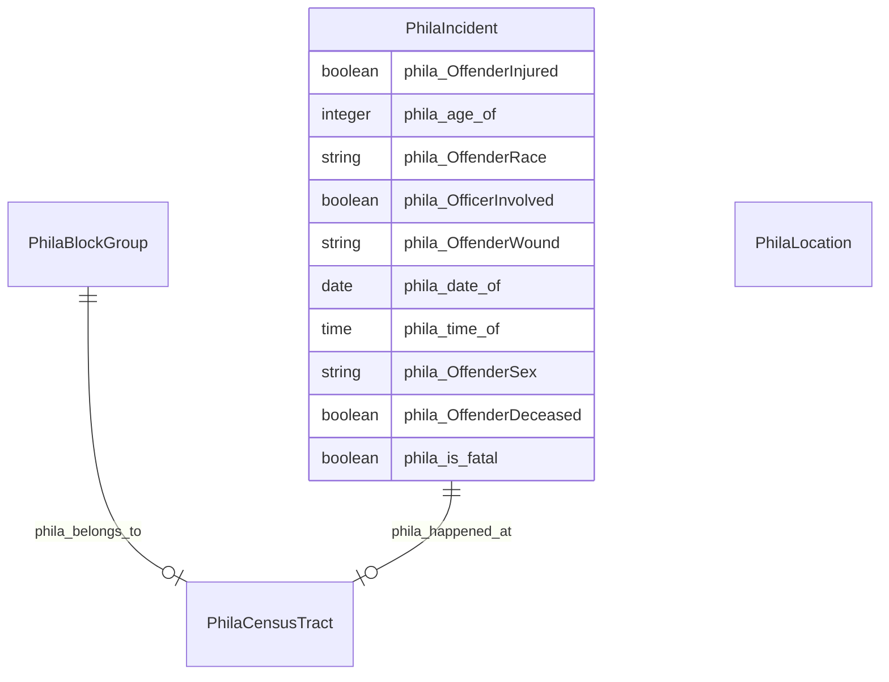

# TODO_Give_this_schema_a_name!

TODO -- tell the world what this schema describes.

URI: neighborhood-kg

Name: neighborhood-kg

## Schema Diagram

## IRI prefixes

* linkml: https://w3id.org/linkml/
* phila: https://metadata.phila.gov/
* rdf: http://www.w3.org/1999/02/22-rdf-syntax-ns#
* rdfs: http://www.w3.org/2000/01/rdf-schema#

## Classes

| Class | Description |
| --- | --- |
| [PhilaBlockGroup](https://github.com/frink-okn/graph-descriptions/blob/main/neighborhood-kg/classes/PhilaBlockGroup.md) | No type description provided Class with 8 occurences.| 
| [PhilaCensusTract](https://github.com/frink-okn/graph-descriptions/blob/main/neighborhood-kg/classes/PhilaCensusTract.md) | No type description provided Class with 361 occurences.| 
| [PhilaIncident](https://github.com/frink-okn/graph-descriptions/blob/main/neighborhood-kg/classes/PhilaIncident.md) | No type description provided Class with 15328 occurences.| 
| [PhilaLocation](https://github.com/frink-okn/graph-descriptions/blob/main/neighborhood-kg/classes/PhilaLocation.md) | No type description provided Class with 9131 occurences.| 

## Slots

| Slot | Description |
| --- | --- |
| [phila_age_of](https://github.com/frink-okn/graph-descriptions/blob/main/neighborhood-kg/slots/phila_age_of.md) | No slot description provided 15093 occurrences with subject type phila_Incident and object type integer.|
| [phila_belongs_to](https://github.com/frink-okn/graph-descriptions/blob/main/neighborhood-kg/slots/phila_belongs_to.md) | No slot description provided 1250 occurrences with subject type phila_BlockGroup and object type phila_CensusTract.|
| [phila_date_of](https://github.com/frink-okn/graph-descriptions/blob/main/neighborhood-kg/slots/phila_date_of.md) | No slot description provided 15328 occurrences with subject type phila_Incident and object type date.|
| [phila_happened_at](https://github.com/frink-okn/graph-descriptions/blob/main/neighborhood-kg/slots/phila_happened_at.md) | No slot description provided 15328 occurrences with subject type phila_Incident and object type phila_CensusTract.|
| [phila_is_fatal](https://github.com/frink-okn/graph-descriptions/blob/main/neighborhood-kg/slots/phila_is_fatal.md) | No slot description provided 15205 occurrences with subject type phila_Incident and object type boolean.|
| [phila_OffenderDeceased](https://github.com/frink-okn/graph-descriptions/blob/main/neighborhood-kg/slots/phila_OffenderDeceased.md) | No slot description provided 15328 occurrences with subject type phila_Incident and object type boolean.|
| [phila_OffenderInjured](https://github.com/frink-okn/graph-descriptions/blob/main/neighborhood-kg/slots/phila_OffenderInjured.md) | No slot description provided 15328 occurrences with subject type phila_Incident and object type boolean.|
| [phila_OffenderRace](https://github.com/frink-okn/graph-descriptions/blob/main/neighborhood-kg/slots/phila_OffenderRace.md) | No slot description provided 15205 occurrences with subject type phila_Incident and object type string.|
| [phila_OffenderSex](https://github.com/frink-okn/graph-descriptions/blob/main/neighborhood-kg/slots/phila_OffenderSex.md) | No slot description provided 15328 occurrences with subject type phila_Incident and object type string.|
| [phila_OffenderWound](https://github.com/frink-okn/graph-descriptions/blob/main/neighborhood-kg/slots/phila_OffenderWound.md) | No slot description provided 15200 occurrences with subject type phila_Incident and object type string.|
| [phila_OfficerInvolved](https://github.com/frink-okn/graph-descriptions/blob/main/neighborhood-kg/slots/phila_OfficerInvolved.md) | No slot description provided 15328 occurrences with subject type phila_Incident and object type boolean.|
| [phila_time_of](https://github.com/frink-okn/graph-descriptions/blob/main/neighborhood-kg/slots/phila_time_of.md) | No slot description provided 15205 occurrences with subject type phila_Incident and object type time.|

