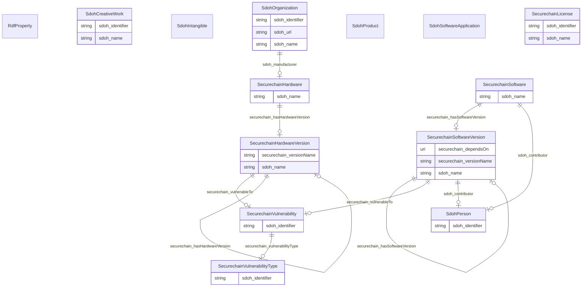

# Secure Chain 
Knowledge Graph Construction for Resilient, Trustworthy, and Secure Software Supply Chains

## Schema Diagram

## IRI prefixes

* linkml: https://w3id.org/linkml/
* rdf: http://www.w3.org/1999/02/22-rdf-syntax-ns#
* rdfs: http://www.w3.org/2000/01/rdf-schema#
* schema: https://schema.org/
* sdoh: http://schema.org/
* securechain: https://w3id.org/secure-chain/

## Classes

| Class | Description |
| --- | --- |
| [RdfProperty](https://github.com/frink-okn/graph-descriptions/blob/main/secure-chain-kg/classes/RdfProperty.md) | No type description provided Class with 7 occurences.| 
| [SdohCreativeWork](https://github.com/frink-okn/graph-descriptions/blob/main/secure-chain-kg/classes/SdohCreativeWork.md) | The most generic kind of creative work, including books, movies, photographs, software programs, etc. Class with 20 occurences.| 
| &nbsp;&nbsp;&nbsp;&nbsp;&nbsp;&nbsp;&nbsp;&nbsp;[SecurechainLicense](https://github.com/frink-okn/graph-descriptions/blob/main/secure-chain-kg/classes/SecurechainLicense.md) | No type description provided Class with 0 occurences.| 
| [SdohIntangible](https://github.com/frink-okn/graph-descriptions/blob/main/secure-chain-kg/classes/SdohIntangible.md) | No type description provided Class with 0 occurences.| 
| &nbsp;&nbsp;&nbsp;&nbsp;&nbsp;&nbsp;&nbsp;&nbsp;[SecurechainVulnerability](https://github.com/frink-okn/graph-descriptions/blob/main/secure-chain-kg/classes/SecurechainVulnerability.md) | No type description provided Class with 259334 occurences.| 
| &nbsp;&nbsp;&nbsp;&nbsp;&nbsp;&nbsp;&nbsp;&nbsp;[SecurechainVulnerabilityType](https://github.com/frink-okn/graph-descriptions/blob/main/secure-chain-kg/classes/SecurechainVulnerabilityType.md) | No type description provided Class with 445 occurences.| 
| [SdohOrganization](https://github.com/frink-okn/graph-descriptions/blob/main/secure-chain-kg/classes/SdohOrganization.md) | An organization such as a school, NGO, corporation, club, etc. Class with 22889 occurences.| 
| [SdohPerson](https://github.com/frink-okn/graph-descriptions/blob/main/secure-chain-kg/classes/SdohPerson.md) | A person (alive, dead, undead, or fictional). Class with 30434 occurences.| 
| [SdohProduct](https://github.com/frink-okn/graph-descriptions/blob/main/secure-chain-kg/classes/SdohProduct.md) | No type description provided Class with 0 occurences.| 
| &nbsp;&nbsp;&nbsp;&nbsp;&nbsp;&nbsp;&nbsp;&nbsp;[SecurechainHardware](https://github.com/frink-okn/graph-descriptions/blob/main/secure-chain-kg/classes/SecurechainHardware.md) | No type description provided Class with 53378 occurences.| 
| &nbsp;&nbsp;&nbsp;&nbsp;&nbsp;&nbsp;&nbsp;&nbsp;&nbsp;&nbsp;&nbsp;&nbsp;&nbsp;&nbsp;&nbsp;&nbsp;[SecurechainHardwareVersion](https://github.com/frink-okn/graph-descriptions/blob/main/secure-chain-kg/classes/SecurechainHardwareVersion.md) | No type description provided Class with 57295 occurences.| 
| [SdohSoftwareApplication](https://github.com/frink-okn/graph-descriptions/blob/main/secure-chain-kg/classes/SdohSoftwareApplication.md) | No type description provided Class with 0 occurences.| 
| &nbsp;&nbsp;&nbsp;&nbsp;&nbsp;&nbsp;&nbsp;&nbsp;[SecurechainSoftware](https://github.com/frink-okn/graph-descriptions/blob/main/secure-chain-kg/classes/SecurechainSoftware.md) | No type description provided Class with 34469 occurences.| 
| &nbsp;&nbsp;&nbsp;&nbsp;&nbsp;&nbsp;&nbsp;&nbsp;&nbsp;&nbsp;&nbsp;&nbsp;&nbsp;&nbsp;&nbsp;&nbsp;[SecurechainSoftwareVersion](https://github.com/frink-okn/graph-descriptions/blob/main/secure-chain-kg/classes/SecurechainSoftwareVersion.md) | No type description provided Class with 164001 occurences.| 

## Slots

| Slot | Description |
| --- | --- |
| [sdoh_contributor](https://github.com/frink-okn/graph-descriptions/blob/main/secure-chain-kg/slots/sdoh_contributor.md) | No slot description provided 33048 occurrences with subject type securechain_Software and object type sdoh_Person. 3668 occurrences with untyped subjects and object type http://schema.org/Person.|
| [sdoh_identifier](https://github.com/frink-okn/graph-descriptions/blob/main/secure-chain-kg/slots/sdoh_identifier.md) | No slot description provided 259334 occurrences with subject type securechain_Vulnerability and object type string. 30434 occurrences with subject type sdoh_Person and object type string. 445 occurrences with subject type securechain_VulnerabilityType and object type string. 887 occurrences with subject type sdoh_Organization and object type string. 20 occurrences with subject type sdoh_CreativeWork and object type string.|
| [sdoh_manufacturer](https://github.com/frink-okn/graph-descriptions/blob/main/secure-chain-kg/slots/sdoh_manufacturer.md) | No slot description provided 54369 occurrences with subject type sdoh_Organization and object type securechain_Hardware.|
| [sdoh_name](https://github.com/frink-okn/graph-descriptions/blob/main/secure-chain-kg/slots/sdoh_name.md) | No slot description provided 53378 occurrences with subject type securechain_Hardware and object type string. 22002 occurrences with subject type sdoh_Organization and object type string. 34469 occurrences with subject type securechain_Software and object type string. 20 occurrences with subject type sdoh_CreativeWork and object type string.|
| [sdoh_url](https://github.com/frink-okn/graph-descriptions/blob/main/secure-chain-kg/slots/sdoh_url.md) | No slot description provided 887 occurrences with subject type sdoh_Organization and object type string.|
| [securechain_dependsOn](https://github.com/frink-okn/graph-descriptions/blob/main/secure-chain-kg/slots/securechain_dependsOn.md) | No slot description provided 696916 occurrences with subject type securechain_SoftwareVersion and object type securechain_SoftwareVersion. 982961 occurrences with untyped subjects and object type https://w3id.org/secure-chain/SoftwareVersion. 39 occurrences with untyped subjects and object type uri. 2 occurrences with subject type securechain_SoftwareVersion and object type uri.|
| [securechain_hasHardwareVersion](https://github.com/frink-okn/graph-descriptions/blob/main/secure-chain-kg/slots/securechain_hasHardwareVersion.md) | No slot description provided 57295 occurrences with subject type securechain_Hardware and object type securechain_HardwareVersion.|
| [securechain_hasSoftwareVersion](https://github.com/frink-okn/graph-descriptions/blob/main/secure-chain-kg/slots/securechain_hasSoftwareVersion.md) | No slot description provided 164001 occurrences with subject type securechain_Software and object type securechain_SoftwareVersion.|
| [securechain_versionName](https://github.com/frink-okn/graph-descriptions/blob/main/secure-chain-kg/slots/securechain_versionName.md) | No slot description provided 164001 occurrences with subject type securechain_SoftwareVersion and object type string. 57295 occurrences with subject type securechain_HardwareVersion and object type string.|
| [securechain_vulnerabilityType](https://github.com/frink-okn/graph-descriptions/blob/main/secure-chain-kg/slots/securechain_vulnerabilityType.md) | No slot description provided 177404 occurrences with subject type securechain_Vulnerability and object type securechain_VulnerabilityType.|
| [securechain_vulnerableTo](https://github.com/frink-okn/graph-descriptions/blob/main/secure-chain-kg/slots/securechain_vulnerableTo.md) | No slot description provided 445386 occurrences with subject type securechain_HardwareVersion and object type securechain_Vulnerability. 21897 occurrences with untyped subjects and object type https://w3id.org/secure-chain/Vulnerability. 5067 occurrences with subject type securechain_SoftwareVersion and object type securechain_Vulnerability.|

