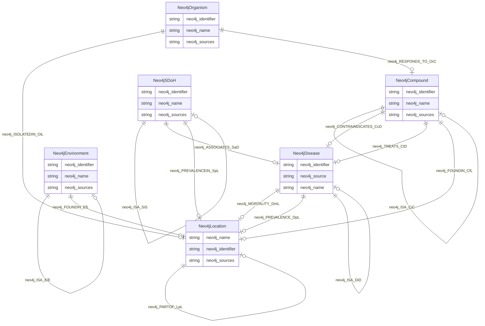

# SPOKE: Connecting Biomedical information on Earth and in Space via the SPOKE knowledge graph

## Schema Diagram

## IRI prefixes

* linkml: https://w3id.org/linkml/
* neo4j: neo4j://graph.schema#
* rdf: http://www.w3.org/1999/02/22-rdf-syntax-ns#

## Classes

| Class | Description |
| --- | --- |
| [Neo4jCompound](https://github.com/frink-okn/graph-descriptions/blob/main/spoke-kg/classes/Neo4jCompound.md) | No type description provided Class with 798 occurences.| 
| [Neo4jDisease](https://github.com/frink-okn/graph-descriptions/blob/main/spoke-kg/classes/Neo4jDisease.md) | No type description provided Class with 180 occurences.| 
| [Neo4jEnvironment](https://github.com/frink-okn/graph-descriptions/blob/main/spoke-kg/classes/Neo4jEnvironment.md) | No type description provided Class with 2 occurences.| 
| [Neo4jLocation](https://github.com/frink-okn/graph-descriptions/blob/main/spoke-kg/classes/Neo4jLocation.md) | No type description provided Class with 106067 occurences.| 
| [Neo4jOrganism](https://github.com/frink-okn/graph-descriptions/blob/main/spoke-kg/classes/Neo4jOrganism.md) | No type description provided Class with 321442 occurences.| 
| [Neo4jSDoH](https://github.com/frink-okn/graph-descriptions/blob/main/spoke-kg/classes/Neo4jSDoH.md) | No type description provided Class with 1426 occurences.| 

## Slots

| Slot | Description |
| --- | --- |
| [neo4j_ASSOCIATES_SaD](https://github.com/frink-okn/graph-descriptions/blob/main/spoke-kg/slots/neo4j_ASSOCIATES_SaD.md) | No slot description provided 39 occurrences with subject type neo4j_SDoH and object type neo4j_Disease.|
| [neo4j_CONTRAINDICATES_CcD](https://github.com/frink-okn/graph-descriptions/blob/main/spoke-kg/slots/neo4j_CONTRAINDICATES_CcD.md) | No slot description provided 51 occurrences with subject type neo4j_Compound and object type neo4j_Disease.|
| [neo4j_FOUNDIN_CfL](https://github.com/frink-okn/graph-descriptions/blob/main/spoke-kg/slots/neo4j_FOUNDIN_CfL.md) | No slot description provided 563803 occurrences with subject type neo4j_Compound and object type neo4j_Location.|
| [neo4j_FOUNDIN_EfL](https://github.com/frink-okn/graph-descriptions/blob/main/spoke-kg/slots/neo4j_FOUNDIN_EfL.md) | No slot description provided 11367 occurrences with subject type neo4j_Environment and object type neo4j_Location.|
| [neo4j_HASROLE_ChC](https://github.com/frink-okn/graph-descriptions/blob/main/spoke-kg/slots/neo4j_HASROLE_ChC.md) | No slot description provided 34 occurrences with subject type neo4j_Compound and object type neo4j_Compound.|
| [neo4j_identifier](https://github.com/frink-okn/graph-descriptions/blob/main/spoke-kg/slots/neo4j_identifier.md) | No slot description provided 2 occurrences with subject type neo4j_Environment and object type string. 1426 occurrences with subject type neo4j_SDoH and object type string. 106067 occurrences with subject type neo4j_Location and object type string. 180 occurrences with subject type neo4j_Disease and object type string. 798 occurrences with subject type neo4j_Compound and object type string. 321442 occurrences with subject type neo4j_Organism and object type string.|
| [neo4j_INTERACTS_CiC](https://github.com/frink-okn/graph-descriptions/blob/main/spoke-kg/slots/neo4j_INTERACTS_CiC.md) | No slot description provided 1 occurrences with subject type neo4j_Compound and object type neo4j_Compound.|
| [neo4j_ISA_CiC](https://github.com/frink-okn/graph-descriptions/blob/main/spoke-kg/slots/neo4j_ISA_CiC.md) | No slot description provided 56 occurrences with subject type neo4j_Compound and object type neo4j_Compound.|
| [neo4j_ISA_DiD](https://github.com/frink-okn/graph-descriptions/blob/main/spoke-kg/slots/neo4j_ISA_DiD.md) | No slot description provided 41 occurrences with subject type neo4j_Disease and object type neo4j_Disease.|
| [neo4j_ISA_EiE](https://github.com/frink-okn/graph-descriptions/blob/main/spoke-kg/slots/neo4j_ISA_EiE.md) | No slot description provided 1 occurrences with subject type neo4j_Environment and object type neo4j_Environment.|
| [neo4j_ISA_SiS](https://github.com/frink-okn/graph-descriptions/blob/main/spoke-kg/slots/neo4j_ISA_SiS.md) | No slot description provided 999 occurrences with subject type neo4j_SDoH and object type neo4j_SDoH.|
| [neo4j_ISOLATEDIN_OiL](https://github.com/frink-okn/graph-descriptions/blob/main/spoke-kg/slots/neo4j_ISOLATEDIN_OiL.md) | No slot description provided 321442 occurrences with subject type neo4j_Organism and object type neo4j_Location.|
| [neo4j_MORTALITY_DmL](https://github.com/frink-okn/graph-descriptions/blob/main/spoke-kg/slots/neo4j_MORTALITY_DmL.md) | No slot description provided 10802 occurrences with subject type neo4j_Disease and object type neo4j_Location.|
| [neo4j_name](https://github.com/frink-okn/graph-descriptions/blob/main/spoke-kg/slots/neo4j_name.md) | No slot description provided 2 occurrences with subject type neo4j_Environment and object type string. 1426 occurrences with subject type neo4j_SDoH and object type string. 106067 occurrences with subject type neo4j_Location and object type string. 180 occurrences with subject type neo4j_Disease and object type string. 798 occurrences with subject type neo4j_Compound and object type string. 321442 occurrences with subject type neo4j_Organism and object type string.|
| [neo4j_PARTOF_CpC](https://github.com/frink-okn/graph-descriptions/blob/main/spoke-kg/slots/neo4j_PARTOF_CpC.md) | No slot description provided 18 occurrences with subject type neo4j_Compound and object type neo4j_Compound.|
| [neo4j_PARTOF_LpL](https://github.com/frink-okn/graph-descriptions/blob/main/spoke-kg/slots/neo4j_PARTOF_LpL.md) | No slot description provided 119810 occurrences with subject type neo4j_Location and object type neo4j_Location.|
| [neo4j_PREVALENCE_DpL](https://github.com/frink-okn/graph-descriptions/blob/main/spoke-kg/slots/neo4j_PREVALENCE_DpL.md) | No slot description provided 275085 occurrences with subject type neo4j_Disease and object type neo4j_Location.|
| [neo4j_PREVALENCEIN_SpL](https://github.com/frink-okn/graph-descriptions/blob/main/spoke-kg/slots/neo4j_PREVALENCEIN_SpL.md) | No slot description provided 2999117 occurrences with subject type neo4j_SDoH and object type neo4j_Location.|
| [neo4j_RESEMBLES_DrD](https://github.com/frink-okn/graph-descriptions/blob/main/spoke-kg/slots/neo4j_RESEMBLES_DrD.md) | No slot description provided 67 occurrences with subject type neo4j_Disease and object type neo4j_Disease.|
| [neo4j_RESPONDS_TO_OrC](https://github.com/frink-okn/graph-descriptions/blob/main/spoke-kg/slots/neo4j_RESPONDS_TO_OrC.md) | No slot description provided 5138 occurrences with subject type neo4j_Organism and object type neo4j_Compound.|
| [neo4j_source](https://github.com/frink-okn/graph-descriptions/blob/main/spoke-kg/slots/neo4j_source.md) | No slot description provided 180 occurrences with subject type neo4j_Disease and object type string.|
| [neo4j_sources](https://github.com/frink-okn/graph-descriptions/blob/main/spoke-kg/slots/neo4j_sources.md) | No slot description provided 2 occurrences with subject type neo4j_Environment and object type string. 1426 occurrences with subject type neo4j_SDoH and object type string. 106067 occurrences with subject type neo4j_Location and object type string. 3336 occurrences with subject type neo4j_Compound and object type string. 321442 occurrences with subject type neo4j_Organism and object type string.|
| [neo4j_TREATS_CtD](https://github.com/frink-okn/graph-descriptions/blob/main/spoke-kg/slots/neo4j_TREATS_CtD.md) | No slot description provided 163 occurrences with subject type neo4j_Compound and object type neo4j_Disease.|

